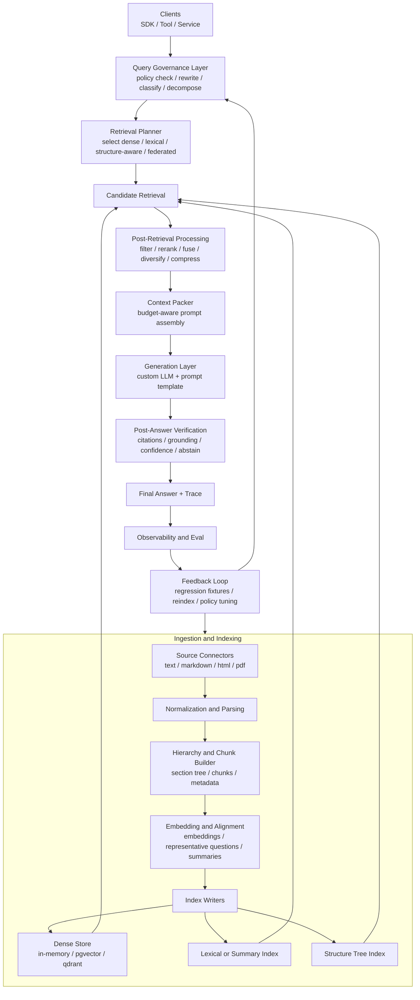
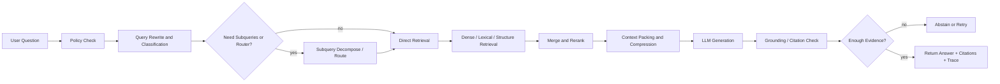
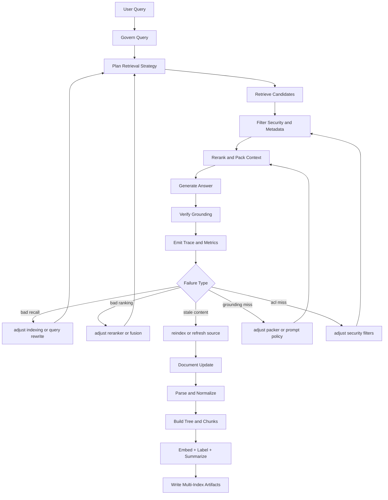

# RAG Production Enhancement Plan

> Archived record only.
> This proposal is retained for historical planning traceability and must not
> be used as an active development guide.
> Current development must follow the live code and current docs in
> `github.com/costa92/llm-agent-rag`.

Date: 2026-05-14
Planning repo: `github.com/costa92/llm-agent`
Primary implementation repo: `github.com/costa92/llm-agent-rag`
Status: proposed

## Goal

Upgrade the current RAG design from a reusable `v0.1` SDK baseline into a
production-oriented retrieval system that supports:

- structure-aware ingestion
- hybrid and policy-driven retrieval
- custom LLMs and custom prompt templates
- persistent backends and metadata filters
- explainable answers with citations and traceability
- evaluation, observability, and operational safety

## External Design Takeaways

### 1. From `VectifyAI/PageIndex`

Source:

- `https://github.com/VectifyAI/PageIndex`
- `https://pageindex.vectify.ai/introduction`

Key ideas worth adopting:

- retrieval should not be reduced to vector similarity alone
- preserve natural document hierarchy instead of flattening everything into
  anonymous chunks
- build an explicit document index that supports reasoning over sections,
  subsections, and page ranges
- keep retrieval explainable:
  - search trajectory
  - selected section IDs
  - page references
- support context-aware retrieval, where the query policy can depend on the
  question, conversation state, and domain

Practical implication for this project:

- we should keep dense vector retrieval, but add a parallel
  structure-aware retrieval path rather than betting on one retrieval method
- the RAG core should support document trees and section references as
  first-class metadata, not only flat chunk IDs

### 2. From `Awesome-RAG-Production`

Source:

- `https://github.com/Yigtwxx/Awesome-RAG-Production`

Note:

- as of 2026-05-14, this is the public GitHub repository I could verify for
  `Awesome-RAG-Production`
- I could not verify a public `Enes830/Awesome-RAG-Production` repository on
  the same date

Key ideas worth adopting:

- production RAG is a system, not a single retriever
- ingestion, indexing, retrieval, reranking, generation, evaluation, and
  observability must be designed as separate layers
- hybrid retrieval, reranking, caching, filtering, and tracing are normal
  requirements in production
- quality needs its own loop:
  - offline evals
  - regression suites
  - latency and cost measurement
  - retrieval diagnostics

Practical implication for this project:

- the current SDK seam design is good, but it needs more production modules
  behind those seams
- evaluation and telemetry should be planned as core deliverables, not as
  post-release cleanup

## Second-Pass Research Gaps

After a second review of the external material and current plan, the direction
is still correct, but several production-critical items are under-specified.

### 1. Security and access control are too far back

Why this is a gap:

- Microsoft explicitly treats document-level authorization, query-time
  filtering, and governance as a core RAG challenge, not an optional
  enterprise extra
- the current plan mentions filters and later operational concerns, but it does
  not elevate ACL/security trimming to a required production track

What to add:

- metadata-based ACL filtering in the store contract
- tenant isolation rules
- authorization-aware retrieval tests
- explicit distinction between:
  - public metadata filters
  - enforced security filters

### 2. Evaluation and observability start too late

Why this is a gap:

- the current plan places formal evaluation in Phase 6
- production guidance from Microsoft and Ragas both treat tracing, forensics,
  golden datasets, and retrieval diagnostics as part of early system design

What to add:

- an eval scaffold and trace hooks in Phase 1
- golden retrieval cases before hybrid and structure-aware retrieval work
- root-cause debugging artifacts:
  - query rewrite trace
  - retrieved candidate list
  - rerank decisions
  - final citations

### 3. Query governance is under-specified

Why this is a gap:

- the plan includes MQE and HyDE, but not broader query preprocessing and
  control
- advanced RAG guidance emphasizes:
  - policy checks
  - query rewriting
  - subquery decomposition
  - conversation-aware routing

What to add:

- query preprocessing stage before retrieval
- query classification:
  - factual
  - comparative
  - analytical
  - unsafe/policy-blocked
- subquery decomposition hooks
- question rewrite trace in diagnostics

### 4. Index freshness and embedding lifecycle need to be first-class

Why this is a gap:

- the plan mentions document versioning, but not a full update strategy
- production guidance highlights:
  - incremental updates
  - selective reindexing
  - delta handling
  - real-time or trigger-based refresh
- production RAG also needs embedding-model version tracking and re-embed
  workflows

What to add:

- index update strategy section in ingestion design
- embedding version fields in metadata
- re-embed / backfill workflow
- tombstone and delete-by-source semantics

### 5. Retrieval alignment is missing

Why this is a gap:

- Microsoft recommends alignment optimization such as storing a representative
  sample question per chunk
- the current plan discusses reranking and structure-aware retrieval, but not
  retrieval labels that improve matching quality

What to add:

- optional `RepresentativeQuestions` metadata per chunk or section
- summary index / section synopsis generation
- retrieval tests for question-to-chunk alignment quality

### 6. Multi-source and federated retrieval are not explicit enough

Why this is a gap:

- current ingestion work assumes indexed content
- modern production systems often need both:
  - indexed corpora
  - directly queried or semi-live sources

What to add:

- connector model that distinguishes:
  - fully indexed sources
  - cached sources
  - live/federated sources
- retrieval planner hooks that can route by source type

### 7. Post-answer verification needs a stronger contract

Why this is a gap:

- the plan includes citations and grounded modes
- it does not clearly define answer validation after generation

What to add:

- answer-level fact check hook
- citation coverage check
- abstain-or-retry policy on weak evidence
- machine-readable answer confidence / evidence quality fields

### 8. Context packing and prompt compression are still under-modeled

Why this is a gap:

- Microsoft explicitly calls out post-retrieval filtering, reranking, and
  prompt compression as a separate stage between retrieval and answer
  generation
- the current plan mentions reranking and prompting, but not the concrete
  budget-management layer that decides what evidence actually fits into the
  final prompt

What to add:

- context packer / prompt packer abstraction
- token-budget-aware evidence selection
- duplicate and near-duplicate evidence suppression
- chunk-to-section expansion rules such as `small2big`
- optional prompt compression using a cheaper model or deterministic reducer

### 9. The feedback loop is implied, but not explicit

Why this is a gap:

- the current plan includes evaluation and update strategy, but it does not
  explicitly show how online failures drive retrieval-policy and indexing
  updates
- a production RAG system needs a closed loop between:
  - user queries
  - retrieval traces
  - answer failures
  - evaluation datasets
  - reindex / rerank / prompt tuning decisions

What to add:

- explicit online-to-offline feedback loop
- failure bucket taxonomy:
  - bad recall
  - bad ranking
  - stale content
  - weak grounding
  - policy / ACL miss
- regression promotion flow from production incident to eval fixture

## Current State

Current implementation already has a good minimal architecture:

- standalone core orchestration lives in
  [rag/system.go](/tmp/llm-agent-rag/rag/system.go:19)
- core seams exist for:
  - `ingest.Splitter`
  - `embed.Embedder`
  - `store.Store`
  - `generate.Model`
  - `prompt.Template`
- current import/retrieve/ask flow exists in:
  - [rag/import.go](/tmp/llm-agent-rag/rag/import.go:11)
  - [rag/retrieve.go](/tmp/llm-agent-rag/rag/retrieve.go:10)
  - [rag/ask.go](/tmp/llm-agent-rag/rag/ask.go:9)
- `llm-agent` keeps a compatibility facade in
  [rag/rag.go](/home/hellotalk/code/go/src/github.com/costa92/llm-agent/rag/rag.go:20)
- the main repo already exposes MQE and HyDE helpers in:
  - [rag/advanced.go](/home/hellotalk/code/go/src/github.com/costa92/llm-agent/rag/advanced.go:1)

Current gaps:

- only `HashEmbedder` ships by default
- only `InMemoryStore` ships by default
- no durable backend
- no first-class reranker seam
- no hybrid retrieval
- store filters exist in the API but are not fully implemented in the default
  backend
- no structure-aware index for sections/pages/headings
- no ingestion jobs, source connectors, or document versioning
- no citation verification or grounded-answer policy
- no eval harness or telemetry layer

## Design Direction

Keep the current seam-based SDK design and extend it. Do not replace it with a
monolithic framework.

Chosen direction:

- keep `llm-agent-rag` as the source of truth for RAG primitives
- keep `llm-agent/rag` as the compatibility and agent-tool facade
- add new capabilities behind stable interfaces
- treat dense retrieval, lexical retrieval, and structure-aware retrieval as
  composable policies
- add security, eval, and update lifecycle as first-class cross-cutting
  concerns rather than late operational add-ons

## Target Architecture

### Layer 1. Ingestion

Responsibilities:

- abstract data import
- source-specific parsing
- document normalization
- section extraction
- chunking and hierarchy capture
- idempotent re-indexing

Planned additions:

- `ingest.Source` implementations for:
  - raw text
  - markdown
  - HTML
  - PDF via pluggable extractor boundary
- `ingest.DocumentTree` or equivalent hierarchical representation
- document identity fields:
  - `SourceID`
  - `Version`
  - `Checksum`
  - `UpdatedAt`
- tokenizer-aware and heading-aware splitters

### Layer 2. Indexing

Responsibilities:

- store dense retrieval artifacts
- store structural retrieval artifacts
- preserve section/page lineage

Planned additions:

- chunk metadata standardization:
  - section path
  - heading level
  - page range
  - source URI
  - document version
- optional tree index package for PageIndex-like section navigation
- index lifecycle operations:
  - full rebuild
  - incremental upsert
  - delete by document
  - namespace stats by version

### Layer 3. Retrieval

Responsibilities:

- query planning
- query governance
- candidate generation
- fusion
- reranking
- answer context assembly

Planned additions:

- query preprocessing:
  - policy check
  - rewrite
  - classification
  - decomposition
- retriever policy abstraction
- dense retrieval
- lexical retrieval
- structure-aware retrieval
- hybrid fusion:
  - reciprocal rank fusion or weighted fusion
- reranker seam:
  - model-based reranker
  - heuristic reranker
- retrieval options:
  - top-k
  - namespace
  - metadata filters
  - score thresholds
  - max-docs-per-source
  - diversity/MMR

### Layer 4. Generation

Responsibilities:

- context packing
- grounded prompting
- citation formatting
- answer policy enforcement

Planned additions:

- context packer abstraction
- richer prompt template interface
- answer envelope with:
  - answer text
  - cited hit IDs
  - retrieval diagnostics
  - prompt metadata
- grounded-answer policy modes:
  - strict cite-only
  - best effort
  - abstain on low evidence

### Layer 5. Production Operations

Responsibilities:

- persistence
- tracing
- eval
- reliability

Planned additions:

- persistent vector backends:
  - `pgvector`
  - `qdrant`
  - one of `milvus` or `weaviate`
- ACL/security trimming hooks
- request-scoped tracing hooks
- ingestion/result caching
- benchmark and regression harness
- cost and latency instrumentation

## Cross-Cutting Tracks

These should not wait for the last phase.

### Track A. Evaluation and tracing

- trace every retrieval stage
- keep golden retrieval datasets
- measure:
  - retrieval accuracy
  - citation coverage
  - latency
  - cost

### Track B. Security and governance

- enforce query-time security filters
- separate user-visible filters from mandatory security filters
- track source-level and namespace-level access rules

### Track C. Update and model lifecycle

- document update strategy
- embedding-model versioning
- reindex and re-embed workflows
- stale-index detection

### Track D. Feedback optimization

- capture production misses and false positives
- convert failures into regression fixtures
- compare retriever / reranker / prompt variants
- feed winning changes back into ingestion and retrieval policy defaults

## Execution Plan

### Phase 1. Harden the core retrieval contract

Objective:

- close correctness gaps without expanding scope too early

Tasks:

- implement real metadata filtering in the default store
- add mandatory security filter plumbing distinct from optional metadata filters
- add delete-by-document support
- add delete-by-source / tombstone semantics
- add namespace-aware stats and source counts
- make retrieval results include stable provenance fields
- add `Answer` metadata for citations and diagnostics
- add request trace structure for query rewrite / candidate / final-hit logging
- align `llm-agent/rag` wrapper with new core response types

Files likely involved:

- `/tmp/llm-agent-rag/store/store.go`
- `/tmp/llm-agent-rag/store/inmemory.go`
- `/tmp/llm-agent-rag/store/types.go`
- `/tmp/llm-agent-rag/rag/retrieve.go`
- `/tmp/llm-agent-rag/rag/ask.go`
- `/home/hellotalk/code/go/src/github.com/costa92/llm-agent/rag/rag.go`
- `/home/hellotalk/code/go/src/github.com/costa92/llm-agent/rag/tool.go`

Exit criteria:

- metadata filters work in tests
- security filters cannot be bypassed by callers
- answers can return machine-readable citations
- retrieval traces are available for debugging
- compatibility layer still passes `go test ./...`

### Phase 2. Add production-grade ingestion metadata

Objective:

- move from plain chunk storage to source-aware document indexing

Tasks:

- add source identity and version fields to document and chunk metadata
- add embedding-model version fields
- add heading-aware markdown splitter
- add HTML-to-document source
- add document tree representation for section hierarchy
- expose import options for chunk policy and metadata enrichment
- define update strategy:
  - incremental
  - selective reindex
  - full rebuild

Files likely involved:

- `/tmp/llm-agent-rag/ingest/types.go`
- `/tmp/llm-agent-rag/ingest/source.go`
- `/tmp/llm-agent-rag/ingest/splitter.go`
- `/tmp/llm-agent-rag/ingest/import.go`
- `/tmp/llm-agent-rag/rag/import.go`

Exit criteria:

- imported chunks preserve source lineage
- markdown sections can be retrieved with section-aware metadata
- re-import can safely replace an existing document version
- index update semantics are documented and tested

### Phase 3. Introduce retriever policies and reranking

Objective:

- turn retrieval into a configurable pipeline instead of one hardcoded search

Tasks:

- add `Retriever` interface
- add query preprocessor interface
- add dense retriever using existing embedder/store
- add lexical retriever for exact term recall
- add fusion strategy abstraction
- add reranker seam and one default heuristic reranker
- move MQE and HyDE out of wrapper-only logic into reusable retrieval policy
- add subquery decomposition hooks
- add representative-question alignment support
- add context packer abstraction and one token-budget-aware default packer

Files likely involved:

- create `/tmp/llm-agent-rag/retrieve/`
- create `/tmp/llm-agent-rag/rerank/`
- update `/tmp/llm-agent-rag/rag/options.go`
- update `/tmp/llm-agent-rag/rag/retrieve.go`
- update `/tmp/llm-agent-rag/adapter/llmagent/tool.go`
- update `/home/hellotalk/code/go/src/github.com/costa92/llm-agent/rag/advanced.go`

Exit criteria:

- caller can choose dense-only, lexical-only, or hybrid retrieval
- reranking is pluggable
- MQE and HyDE can be enabled from the standalone SDK
- query rewrite and decomposition are visible in trace output
- packed prompt context is explainable and token-budget-aware

### Phase 4. Add structure-aware retrieval

Objective:

- incorporate the strongest idea from PageIndex without abandoning vectors

Tasks:

- add a hierarchical document tree type
- add tree navigation helpers
- add section-level retrieval path based on headings/summaries/path matching
- add search trajectory output for explainability
- add policy routing:
  - short factual query -> dense/hybrid
  - long analytical query over structured docs -> structure-aware path

Files likely involved:

- create `/tmp/llm-agent-rag/tree/`
- create `/tmp/llm-agent-rag/retrieve/structure.go`
- update `/tmp/llm-agent-rag/ingest/`
- update `/tmp/llm-agent-rag/rag/retrieve.go`
- update `/tmp/llm-agent-rag/prompt/default.go`

Exit criteria:

- section tree can be built from markdown documents
- retrieval can return section path and search trajectory
- prompts can cite section/path references, not only chunk IDs

### Phase 5. Add persistent backends and operational tooling

Objective:

- make the SDK usable outside in-memory demos

Tasks:

- implement one SQL-backed vector store:
  - recommended first choice: `pgvector`
- implement one remote vector backend:
  - recommended first choice: `qdrant`
- add backend conformance tests
- add ingest benchmark and retrieval benchmark suites
- add tracing hooks for import, retrieve, ask
- add cache hooks for embeddings and retrieval candidates

Files likely involved:

- create `/tmp/llm-agent-rag/store/pgvector/`
- create `/tmp/llm-agent-rag/store/qdrant/`
- create `/tmp/llm-agent-rag/observe/`
- create `/tmp/llm-agent-rag/eval/`

Exit criteria:

- the same retrieval tests run against in-memory and persistent backends
- latency and error metrics can be emitted via hooks
- benchmark outputs are reproducible in CI or local scripts

### Phase 6. Add evaluation and release gates

Objective:

- make quality regressions visible before release

Tasks:

- define gold retrieval cases:
  - exact hit
  - ambiguous hit
  - filter-constrained hit
  - multi-hop section lookup
- define security-trimming cases
- define stale-index / update-freshness cases
- define answer-grounding checks
- add smoke datasets for markdown and HTML
- add CI jobs for:
  - retrieval correctness
  - answer citation coverage
  - backend conformance
- document recommended production deployment patterns

Files likely involved:

- create `/tmp/llm-agent-rag/testdata/`
- create `/tmp/llm-agent-rag/eval/`
- update `/tmp/llm-agent-rag/.github/workflows/`
- update `/tmp/llm-agent-rag/README.md`
- update `/home/hellotalk/code/go/src/github.com/costa92/llm-agent/docs/`

Exit criteria:

- CI can fail on retrieval regressions
- documented evaluation scenarios exist for all major retrieval policies
- README includes production guidance and backend selection advice

## Recommended Delivery Order

1. Phase 1
2. Phase 2
3. Phase 3
4. Phase 4
5. Phase 5
6. Phase 6

Reasoning:

- Phase 1 and 2 fix contract and data-model weaknesses first
- Phase 3 gives immediate quality improvement with manageable complexity
- Phase 4 should follow soon after because hierarchy-aware retrieval depends on
  the retrieval policy work and ingestion metadata from earlier phases
- Phase 5 unlocks actual deployment value once retrieval contracts stabilize
- Phase 6 should evolve in parallel from Phase 1 onward, even if final release
  gates mature later

## Non-Goals For The First Production Wave

- full OCR pipeline inside this repo
- image-native or multimodal RAG
- distributed ingestion workers
- full enterprise IAM integration beyond metadata-based security trimming
- web UI or hosted service packaging

These can be added later once the retrieval substrate is stable.

## First Implementation Slice Recommendation

Recommended first execution slice:

- Phase 1 in full
- Phase 2 limited to markdown hierarchy support
- Phase 3 limited to:
  - lexical retriever
  - hybrid fusion
  - reusable MQE/HyDE policy hooks

Why this slice first:

- it materially improves retrieval quality
- it does not require immediate external infrastructure
- it keeps changes mostly inside `llm-agent-rag`
- it creates the right contract for later persistent backends and
  structure-aware retrieval

## Verification Standard

Every phase should ship with:

- package-level unit tests
- at least one end-to-end retrieval test
- compatibility validation from `llm-agent`
- updated docs and migration notes

Minimum commands:

```bash
cd /tmp/llm-agent-rag
GOWORK=off GOCACHE=/tmp/go-build go test ./...

cd /home/hellotalk/code/go/src/github.com/costa92/llm-agent
GOWORK=off GOCACHE=/tmp/go-build go test ./...
```

## Architecture Diagram



## Online Request Flow



## System Logic Diagram



## Summary

The project should evolve toward a modular production RAG stack with three
retrieval modes:

- dense retrieval for fast default recall
- hybrid retrieval for robust production quality
- structure-aware retrieval for long, complex, hierarchical documents

That direction keeps the current SDK architecture intact, applies the strongest
ideas from PageIndex, and follows the production layering emphasized by
Awesome-RAG-Production.
