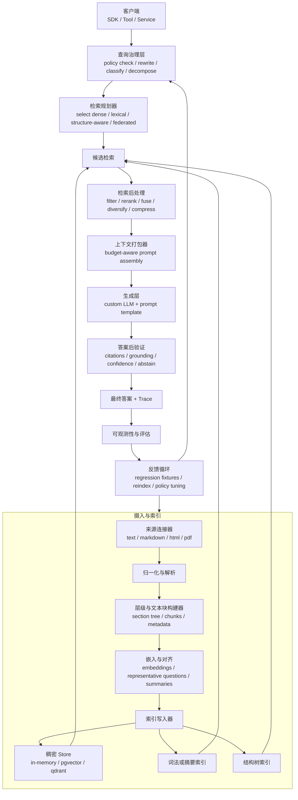
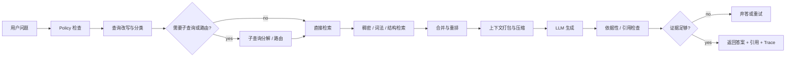
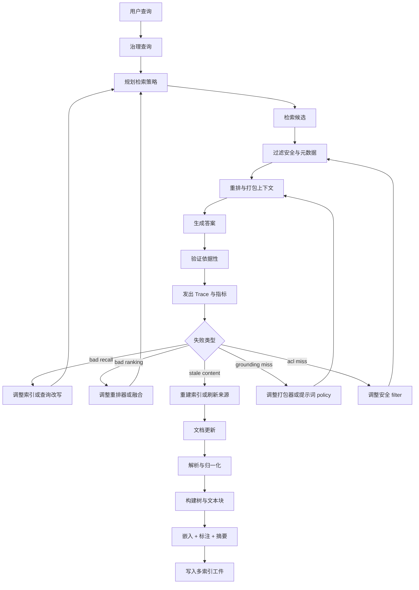

[English](./2026-05-14-rag-production-enhancement-plan.md) | [简体中文](./2026-05-14-rag-production-enhancement-plan.zh-CN.md)

# RAG Production Enhancement Plan

> 仅为归档记录。
> 本提案为历史规划可追溯性而保留，绝不可作为活跃的开发指南。
> 当前开发必须遵循 `github.com/costa92/llm-agent-rag` 中的活代码与现行文档。

Date: 2026-05-14
Planning repo: `github.com/costa92/llm-agent`
Primary implementation repo: `github.com/costa92/llm-agent-rag`
Status: proposed

## Goal

把当前的 RAG 设计从一个可复用的 `v0.1` SDK 基线升级为一个面向生产的检索系统，支持：

- 结构感知的摄入
- 混合的、策略驱动的检索
- 自定义 LLM 和自定义提示词模板
- 持久后端和元数据 filter
- 带引用和可追溯性的可解释答案
- 评估、可观测性和运维安全

## External Design Takeaways

### 1. From `VectifyAI/PageIndex`

来源：

- `https://github.com/VectifyAI/PageIndex`
- `https://pageindex.vectify.ai/introduction`

值得采纳的关键思想：

- 检索不应被简化为仅向量相似度
- 保留文档的自然层级，而非把一切扁平化成匿名文本块
- 构建一个显式的文档索引，支持在章节、子章节和页范围上进行推理
- 让检索保持可解释：
  - 搜索轨迹
  - 选中的章节 ID
  - 页引用
- 支持上下文感知的检索，其中查询 policy 可以取决于问题、对话状态和领域

对本项目的实际含义：

- 我们应保留稠密向量检索，但增加一条并行的结构感知检索路径，而非押注于单一检索方法
- RAG 核心应把文档树和章节引用作为一等元数据支持，而非仅扁平的文本块 ID

### 2. From `Awesome-RAG-Production`

来源：

- `https://github.com/Yigtwxx/Awesome-RAG-Production`

注意：

- 截至 2026-05-14，这是我能为 `Awesome-RAG-Production` 验证的公开 GitHub 仓库
- 同一日期我无法验证一个公开的 `Enes830/Awesome-RAG-Production` 仓库

值得采纳的关键思想：

- 生产 RAG 是一个系统，而非单个检索器
- 摄入、索引、检索、重排、生成、评估和可观测性必须被设计为独立的层
- 混合检索、重排、缓存、过滤和追踪在生产中是常规需求
- 质量需要它自己的循环：
  - 离线评估
  - 回归套件
  - 延迟和成本测量
  - 检索诊断

对本项目的实际含义：

- 当前的 SDK 接缝设计很好，但它需要在那些接缝之后有更多生产模块
- 评估和遥测应被规划为核心交付物，而非发布后的清理

## Second-Pass Research Gaps

在对外部材料和当前计划进行第二轮审视后，方向仍然正确，但若干生产关键项缺乏明确说明。

### 1. Security and access control are too far back

为什么这是一个缺口：

- Microsoft 明确把文档级授权、查询时过滤和治理视为核心 RAG 挑战，而非可选的企业额外项
- 当前计划提到了 filter 和后续运维关切，但它没有把 ACL/安全裁剪提升为一条必需的生产轨道

要添加什么：

- store 契约中基于元数据的 ACL 过滤
- 租户隔离规则
- 授权感知的检索测试
- 明确区分：
  - 公开的元数据 filter
  - 强制的安全 filter

### 2. Evaluation and observability start too late

为什么这是一个缺口：

- 当前计划把正式评估放在 Phase 6
- 来自 Microsoft 和 Ragas 的生产指引都把追踪、取证、黄金数据集和检索诊断视为早期系统设计的一部分

要添加什么：

- 在 Phase 1 中的一个评估脚手架和 trace 钩子
- 在混合和结构感知检索工作之前的黄金检索用例
- 根因调试工件：
  - 查询改写链路
  - 检索候选列表
  - 重排决策
  - 最终引用

### 3. Query governance is under-specified

为什么这是一个缺口：

- 计划包含 MQE 和 HyDE，但不包含更广泛的查询预处理和控制
- 高级 RAG 指引强调：
  - policy 检查
  - 查询改写
  - 子查询分解
  - 对话感知的路由

要添加什么：

- 检索之前的查询预处理阶段
- 查询分类：
  - 事实型
  - 比较型
  - 分析型
  - 不安全/被 policy 拦截
- 子查询分解钩子
- 诊断中的问题改写链路

### 4. Index freshness and embedding lifecycle need to be first-class

为什么这是一个缺口：

- 计划提到了文档版本管理，但不包含完整的更新策略
- 生产指引强调：
  - 增量更新
  - 选择性重建索引
  - 增量处理
  - 实时或基于触发的刷新
- 生产 RAG 还需要嵌入模型版本追踪和重新嵌入工作流

要添加什么：

- 摄入设计中的索引更新策略小节
- 元数据中的嵌入版本字段
- 重新嵌入 / 回填工作流
- 墓碑（tombstone）和按来源删除的语义

### 5. Retrieval alignment is missing

为什么这是一个缺口：

- Microsoft 推荐对齐优化，例如为每个文本块存储一个代表性的样本问题
- 当前计划讨论了重排和结构感知检索，但不包含提升匹配质量的检索标签

要添加什么：

- 每个文本块或章节可选的 `RepresentativeQuestions` 元数据
- 摘要索引 / 章节梗概生成
- 针对问题到文本块对齐质量的检索测试

### 6. Multi-source and federated retrieval are not explicit enough

为什么这是一个缺口：

- 当前的摄入工作假设内容已被索引
- 现代生产系统常常同时需要：
  - 已索引的语料
  - 直接查询或半实时的来源

要添加什么：

- 一个区分以下的连接器模型：
  - 完全索引的来源
  - 缓存的来源
  - 实时/联邦的来源
- 能按来源类型路由的检索规划器钩子

### 7. Post-answer verification needs a stronger contract

为什么这是一个缺口：

- 计划包含引用和有依据模式
- 它没有清晰定义生成后的答案验证

要添加什么：

- 答案级的事实检查钩子
- 引用覆盖检查
- 证据薄弱时的弃答或重试 policy
- 机器可读的答案置信度 / 证据质量字段

### 8. Context packing and prompt compression are still under-modeled

为什么这是一个缺口：

- Microsoft 明确把检索后过滤、重排和提示词压缩点名为检索与答案生成之间的一个独立阶段
- 当前计划提到了重排和提示，但不包含决定哪些证据实际放进最终提示词的具体预算管理层

要添加什么：

- 上下文打包器 / 提示词打包器抽象
- token 预算感知的证据选择
- 重复和近重复证据抑制
- 文本块到章节的扩展规则，例如 `small2big`
- 使用更便宜的模型或确定性 reducer 的可选提示词压缩

### 9. The feedback loop is implied, but not explicit

为什么这是一个缺口：

- 当前计划包含评估和更新策略，但它没有显式展示线上失败如何驱动检索 policy 和索引更新
- 一个生产 RAG 系统需要在以下之间形成闭环：
  - 用户查询
  - 检索链路
  - 答案失败
  - 评估数据集
  - 重建索引 / 重排 / 提示词调优决策

要添加什么：

- 显式的线上到离线反馈循环
- 失败分桶分类法：
  - 召回差
  - 排名差
  - 内容陈旧
  - 依据性弱
  - policy / ACL 漏判
- 从生产事故到评估 fixture 的回归提升流程

## Current State

当前实现已经有一个良好的最小架构：

- 独立的核心编排住在 [rag/system.go](/tmp/llm-agent-rag/rag/system.go:19)
- 核心接缝存在于：
  - `ingest.Splitter`
  - `embed.Embedder`
  - `store.Store`
  - `generate.Model`
  - `prompt.Template`
- 当前的 import/retrieve/ask 流程存在于：
  - [rag/import.go](/tmp/llm-agent-rag/rag/import.go:11)
  - [rag/retrieve.go](/tmp/llm-agent-rag/rag/retrieve.go:10)
  - [rag/ask.go](/tmp/llm-agent-rag/rag/ask.go:9)
- `llm-agent` 在 [rag/rag.go](/home/hellotalk/code/go/src/github.com/costa92/llm-agent/rag/rag.go:20) 中保留一个兼容性门面
- 主仓库已在以下位置暴露 MQE 和 HyDE 辅助：
  - [rag/advanced.go](/home/hellotalk/code/go/src/github.com/costa92/llm-agent/rag/advanced.go:1)

当前缺口：

- 默认只附带 `HashEmbedder`
- 默认只附带 `InMemoryStore`
- 没有持久后端
- 没有一等的重排器接缝
- 没有混合检索
- store filter 在 API 中存在，但在默认后端中未完全实现
- 没有面向章节/页/标题的结构感知索引
- 没有摄入作业、来源连接器或文档版本管理
- 没有引用验证或有依据答案 policy
- 没有评估套件或遥测层

## Design Direction

保留当前基于接缝的 SDK 设计并扩展它。不要用一个单体框架替换它。

选定方向：

- 把 `llm-agent-rag` 保持为 RAG 原语的事实来源
- 把 `llm-agent/rag` 保持为兼容性和 agent-tool 门面
- 在稳定接口之后添加新能力
- 把稠密检索、词法检索和结构感知检索视为可组合的 policy
- 把安全、评估和更新生命周期作为一等的横切关切，而非后期的运维附加

## Target Architecture

### Layer 1. Ingestion

职责：

- 抽象的数据导入
- 来源专属的解析
- 文档归一化
- 章节抽取
- 切块和层级捕获
- 幂等的重建索引

计划添加：

- 面向以下的 `ingest.Source` 实现：
  - 原始文本
  - markdown
  - HTML
  - 经由可插拔抽取器边界的 PDF
- `ingest.DocumentTree` 或等价的层级表示
- 文档身份字段：
  - `SourceID`
  - `Version`
  - `Checksum`
  - `UpdatedAt`
- tokenizer 感知和标题感知的切分器

### Layer 2. Indexing

职责：

- 存储稠密检索工件
- 存储结构检索工件
- 保留章节/页谱系

计划添加：

- 文本块元数据标准化：
  - 章节路径
  - 标题层级
  - 页范围
  - 来源 URI
  - 文档版本
- 可选的树索引包，用于类 PageIndex 的章节导航
- 索引生命周期操作：
  - 完全重建
  - 增量 upsert
  - 按文档删除
  - 按版本的命名空间 stats

### Layer 3. Retrieval

职责：

- 查询规划
- 查询治理
- 候选生成
- 融合
- 重排
- 答案上下文组装

计划添加：

- 查询预处理：
  - policy 检查
  - 改写
  - 分类
  - 分解
- 检索器 policy 抽象
- 稠密检索
- 词法检索
- 结构感知检索
- 混合融合：
  - 倒数排名融合或加权融合
- 重排器接缝：
  - 基于模型的重排器
  - 启发式重排器
- 检索选项：
  - top-k
  - 命名空间
  - 元数据 filter
  - 分数阈值
  - 每来源最大文档数
  - 多样性/MMR

### Layer 4. Generation

职责：

- 上下文打包
- 有依据的提示
- 引用格式化
- 答案 policy 强制

计划添加：

- 上下文打包器抽象
- 更丰富的提示词模板接口
- 答案信封，包含：
  - 答案文本
  - 被引用的命中 ID
  - 检索诊断
  - 提示词元数据
- 有依据答案 policy 模式：
  - 严格仅引用
  - 尽力而为
  - 低证据时弃答

### Layer 5. Production Operations

职责：

- 持久化
- 追踪
- 评估
- 可靠性

计划添加：

- 持久向量后端：
  - `pgvector`
  - `qdrant`
  - `milvus` 或 `weaviate` 之一
- ACL/安全裁剪钩子
- 请求作用域的追踪钩子
- 摄入/结果缓存
- 基准测试和回归套件
- 成本和延迟仪表化

## Cross-Cutting Tracks

这些不应等到最后一个 phase。

### Track A. Evaluation and tracing

- 追踪每个检索阶段
- 保留黄金检索数据集
- 测量：
  - 检索精度
  - 引用覆盖
  - 延迟
  - 成本

### Track B. Security and governance

- 强制查询时的安全 filter
- 把用户可见的 filter 与强制的安全 filter 分离
- 追踪来源级和命名空间级的访问规则

### Track C. Update and model lifecycle

- 文档更新策略
- 嵌入模型版本管理
- 重建索引和重新嵌入工作流
- 陈旧索引检测

### Track D. Feedback optimization

- 捕获生产中的漏判和误判
- 把失败转换成回归 fixture
- 比较检索器 / 重排器 / 提示词变体
- 把胜出的改动反馈进摄入和检索 policy 默认值

## Execution Plan

### Phase 1. Harden the core retrieval contract

目标：

- 在不过早扩大范围的情况下关闭正确性缺口

任务：

- 在默认 store 中实现真正的元数据过滤
- 添加独立于可选元数据 filter 的强制安全 filter 管道
- 添加按文档删除支持
- 添加按来源删除 / 墓碑语义
- 添加命名空间感知的 stats 和来源计数
- 让检索结果包含稳定的溯源字段
- 为引用和诊断添加 `Answer` 元数据
- 为查询改写 / 候选 / 最终命中的日志添加请求 trace 结构
- 把 `llm-agent/rag` 包装器与新的核心响应类型对齐

可能涉及的文件：

- `/tmp/llm-agent-rag/store/store.go`
- `/tmp/llm-agent-rag/store/inmemory.go`
- `/tmp/llm-agent-rag/store/types.go`
- `/tmp/llm-agent-rag/rag/retrieve.go`
- `/tmp/llm-agent-rag/rag/ask.go`
- `/home/hellotalk/code/go/src/github.com/costa92/llm-agent/rag/rag.go`
- `/home/hellotalk/code/go/src/github.com/costa92/llm-agent/rag/tool.go`

退出标准：

- 元数据 filter 在测试中工作
- 安全 filter 无法被调用方绕过
- 答案能返回机器可读的引用
- 检索 trace 可用于调试
- 兼容层仍然通过 `go test ./...`

### Phase 2. Add production-grade ingestion metadata

目标：

- 从纯文本块存储转向来源感知的文档索引

任务：

- 为文档和文本块元数据添加来源身份和版本字段
- 添加嵌入模型版本字段
- 添加标题感知的 markdown 切分器
- 添加 HTML 到文档的 source
- 为章节层级添加文档树表示
- 为切块 policy 和元数据富化暴露导入选项
- 定义更新策略：
  - 增量
  - 选择性重建索引
  - 完全重建

可能涉及的文件：

- `/tmp/llm-agent-rag/ingest/types.go`
- `/tmp/llm-agent-rag/ingest/source.go`
- `/tmp/llm-agent-rag/ingest/splitter.go`
- `/tmp/llm-agent-rag/ingest/import.go`
- `/tmp/llm-agent-rag/rag/import.go`

退出标准：

- 导入的文本块保留来源谱系
- markdown 章节能以章节感知的元数据被检索
- 重新导入能安全地替换一个已有的文档版本
- 索引更新语义有文档记录并经测试

### Phase 3. Introduce retriever policies and reranking

目标：

- 把检索变成一个可配置的流水线，而非一次硬编码的搜索

任务：

- 添加 `Retriever` 接口
- 添加查询预处理器接口
- 用现有的 embedder/store 添加稠密检索器
- 为精确词项召回添加词法检索器
- 添加融合策略抽象
- 添加重排器接缝和一个默认的启发式重排器
- 把 MQE 和 HyDE 从仅包装器逻辑移入可复用的检索 policy
- 添加子查询分解钩子
- 添加代表性问题对齐支持
- 添加上下文打包器抽象和一个 token 预算感知的默认打包器

可能涉及的文件：

- create `/tmp/llm-agent-rag/retrieve/`
- create `/tmp/llm-agent-rag/rerank/`
- update `/tmp/llm-agent-rag/rag/options.go`
- update `/tmp/llm-agent-rag/rag/retrieve.go`
- update `/tmp/llm-agent-rag/adapter/llmagent/tool.go`
- update `/home/hellotalk/code/go/src/github.com/costa92/llm-agent/rag/advanced.go`

退出标准：

- 调用方能选择仅稠密、仅词法或混合检索
- 重排是可插拔的
- MQE 和 HyDE 能从独立 SDK 启用
- 查询改写和分解在 trace 输出中可见
- 打包后的提示词上下文是可解释且 token 预算感知的

### Phase 4. Add structure-aware retrieval

目标：

- 在不放弃向量的情况下纳入 PageIndex 最强的思想

任务：

- 添加一个层级文档树类型
- 添加树导航辅助
- 基于标题/摘要/路径匹配添加章节级检索路径
- 为可解释性添加搜索轨迹输出
- 添加 policy 路由：
  - 短的事实型查询 -> 稠密/混合
  - 针对结构化文档的长分析型查询 -> 结构感知路径

可能涉及的文件：

- create `/tmp/llm-agent-rag/tree/`
- create `/tmp/llm-agent-rag/retrieve/structure.go`
- update `/tmp/llm-agent-rag/ingest/`
- update `/tmp/llm-agent-rag/rag/retrieve.go`
- update `/tmp/llm-agent-rag/prompt/default.go`

退出标准：

- 能从 markdown 文档构建章节树
- 检索能返回章节路径和搜索轨迹
- 提示词能引用章节/路径引用，而非仅文本块 ID

### Phase 5. Add persistent backends and operational tooling

目标：

- 让 SDK 在内存演示之外可用

任务：

- 实现一个 SQL 支撑的向量 store：
  - 推荐的首选：`pgvector`
- 实现一个远程向量后端：
  - 推荐的首选：`qdrant`
- 添加后端一致性测试
- 添加摄入基准测试和检索基准测试套件
- 为 import、retrieve、ask 添加追踪钩子
- 为嵌入和检索候选添加缓存钩子

可能涉及的文件：

- create `/tmp/llm-agent-rag/store/pgvector/`
- create `/tmp/llm-agent-rag/store/qdrant/`
- create `/tmp/llm-agent-rag/observe/`
- create `/tmp/llm-agent-rag/eval/`

退出标准：

- 同一套检索测试针对内存和持久后端运行
- 延迟和错误指标能经由钩子发出
- 基准测试输出在 CI 或本地脚本中可复现

### Phase 6. Add evaluation and release gates

目标：

- 在发布前让质量回归可见

任务：

- 定义黄金检索用例：
  - 精确命中
  - 歧义命中
  - filter 约束的命中
  - 多跳章节查找
- 定义安全裁剪用例
- 定义陈旧索引 / 更新新鲜度用例
- 定义答案依据性检查
- 为 markdown 和 HTML 添加冒烟数据集
- 为以下添加 CI 作业：
  - 检索正确性
  - 答案引用覆盖
  - 后端一致性
- 记录推荐的生产部署模式

可能涉及的文件：

- create `/tmp/llm-agent-rag/testdata/`
- create `/tmp/llm-agent-rag/eval/`
- update `/tmp/llm-agent-rag/.github/workflows/`
- update `/tmp/llm-agent-rag/README.md`
- update `/home/hellotalk/code/go/src/github.com/costa92/llm-agent/docs/`

退出标准：

- CI 能在检索回归时失败
- 所有主要检索 policy 都有记录的评估场景
- README 包含生产指引和后端选型建议

## Recommended Delivery Order

1. Phase 1
2. Phase 2
3. Phase 3
4. Phase 4
5. Phase 5
6. Phase 6

理由：

- Phase 1 和 2 先修复契约和数据模型的弱点
- Phase 3 以可控的复杂度带来立竿见影的质量提升
- Phase 4 应紧随其后，因为层级感知检索依赖检索 policy 工作和更早 phase 的摄入元数据
- 一旦检索契约稳定，Phase 5 解锁实际的部署价值
- Phase 6 应从 Phase 1 起并行演进，即使最终的发布门禁更晚成熟

## Non-Goals For The First Production Wave

- 本仓库内的完整 OCR 流水线
- 原生图像或多模态 RAG
- 分布式摄入 worker
- 超出基于元数据的安全裁剪的完整企业 IAM 集成
- web UI 或托管服务打包

这些可以在检索基底稳定后再添加。

## First Implementation Slice Recommendation

推荐的首个执行切片：

- 完整的 Phase 1
- 限于 markdown 层级支持的 Phase 2
- 限于以下的 Phase 3：
  - 词法检索器
  - 混合融合
  - 可复用的 MQE/HyDE policy 钩子

为什么先做这个切片：

- 它实质性地提升检索质量
- 它不需要立即的外部基础设施
- 它把改动大多保持在 `llm-agent-rag` 内
- 它为之后的持久后端和结构感知检索建立了正确的契约

## Verification Standard

每个 phase 都应附带：

- 包级单元测试
- 至少一个端到端检索测试
- 来自 `llm-agent` 的兼容性验证
- 更新的文档和迁移说明

最小命令：

```bash
cd /tmp/llm-agent-rag
GOWORK=off GOCACHE=/tmp/go-build go test ./...

cd /home/hellotalk/code/go/src/github.com/costa92/llm-agent
GOWORK=off GOCACHE=/tmp/go-build go test ./...
```

## Architecture Diagram



## Online Request Flow



## System Logic Diagram



## Summary

本项目应朝着一个带三种检索模式的模块化生产 RAG 栈演进：

- 稠密检索，用于快速的默认召回
- 混合检索，用于稳健的生产质量
- 结构感知检索，用于长的、复杂的、层级化的文档

该方向保持当前的 SDK 架构完整，应用 PageIndex 最强的思想，并遵循 Awesome-RAG-Production 强调的生产分层。
